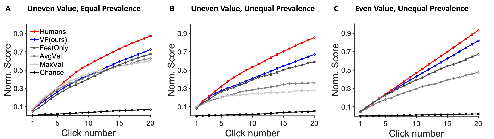
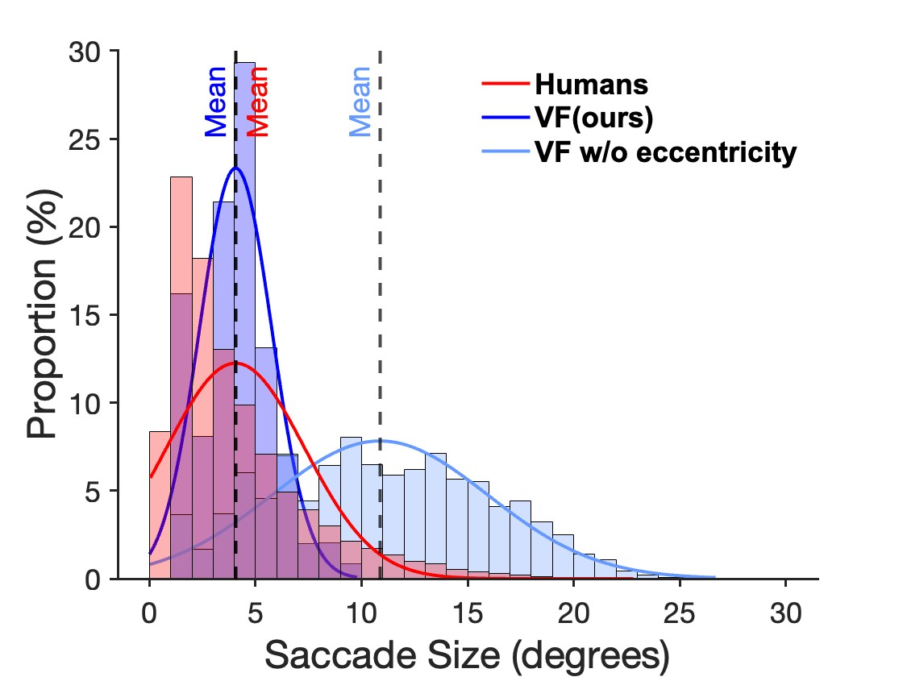
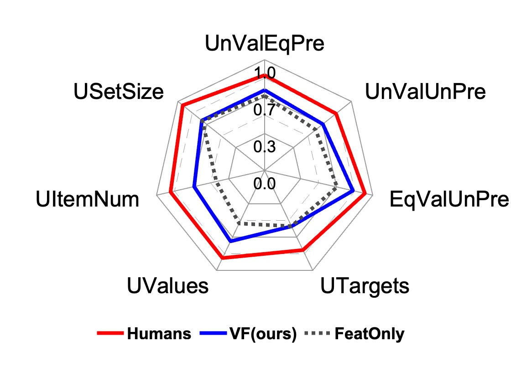

# Gazing at Rewards: Eye Movements as a Lens into Human and AI Decision-Making in Hybrid Visual Foraging

This repository contains the official implementation of our CVPR 2025 paper:

**"Gazing at Rewards: Eye Movements as a Lens into Human and AI Decision-Making in Hybrid Visual Foraging"**

Imagine searching a collection of coins for quarters ($0.25$), dimes ($0.10$), nickels ($0.05$), and pennies ($0.01$)—a hybrid foraging task where observers look for multiple instances of multiple target types. In such tasks, how do target values and their prevalence influence foraging and eye movement behaviors (e.g., should you prioritize rare quarters or common nickels)? To explore this, we conducted human psychophysics experiments, revealing that humans are proficient reward foragers. Their eye fixations are drawn to regions with higher average rewards, fixation durations are longer on more valuable targets, and their cumulative rewards exceed chance, approaching the upper bound of optimal foragers. To probe these decision-making processes of humans, we developed a transformer-based Visual Forager (VF) model trained via reinforcement learning. Our VF model takes a series of targets, their corresponding values, and the search image as inputs, processes the images using foveated vision, and produces a sequence of eye movements along with decisions on whether to collect each fixated item. Our model outperforms all baselines, achieves cumulative rewards comparable to those of humans, and approximates human foraging behavior in eye movements and foraging biases within time-limited environments. Furthermore, stress tests on out-of-distribution tasks with novel targets, unseen values, and varying set sizes demonstrate the VF model’s effective generalization. Our work offers valuable insights into the relationship between eye movements and decision-making, with our model serving as a powerful tool for further exploration of this connection.

## Installation

conda create -f environment.yml

## Download

Download pretrained model from https://drive.google.com/drive/folders/1JMXkr1bNewBRpggOIRc8nfRi0grh76OB?usp=share_link and replace the folder [data](./second-training-stage/data/).

## Usage
To train the model:
1. Run the first training stage
```
cd first-training-stage
python train.py
```

2. Run the second training stage
```
cd second-training-stage
./runSecondStageTrain.sh
```

To test the model:
```
cd second-training-stage
./test_full_vf.sh
```

## Results

To plot Norm.Score: run matlab code [plot_cumulativeScore.m](./human-foraging-data-analysis/plot_cumulativeScore.m).



To plot saccade size: run matlab code [plot_saccade.m](./human-foraging-data-analysis/plot_saccade.m).



To plot Spider of OOD performance: run matlab code [plot_spyder.m](./human-foraging-data-analysis/plot_spyder.m).



## Citation

If you use this code, please cite our paper:
```
@article{wang2024gazing,
  title={Gazing at Rewards: Eye Movements as a Lens into Human and AI Decision-Making in Hybrid Visual Foraging},
  author={Wang, Bo and Tan, Dingwei and Kuo, Yen-Ling and Sun, Zhaowei and Wolfe, Jeremy M and Cham, Tat-Jen and Zhang, Mengmi},
  journal={arXiv preprint arXiv:2411.09176},
  year={2024}
}
```
